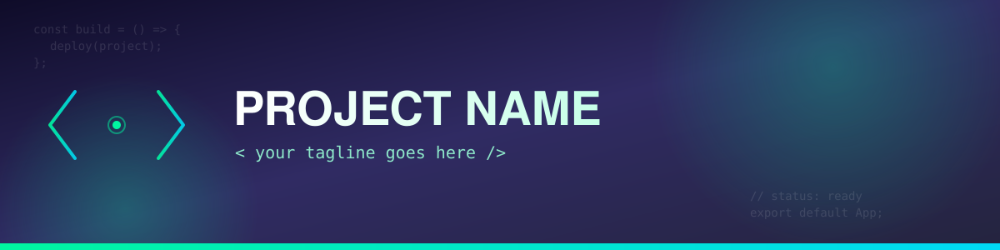

<!-- Header Banner -->

  

 

<!-- Intro & Tech Stack Grid -->
<table>
  <tr>
    <td width="55%" valign="top">
      
      <h3>Hi, I'm Ahsan Sadi 👋</h3>
      <h4>Full-Stack Developer</h4>
      

        I'm a passionate Full-Stack Developer focused on building modern, responsive, and user-friendly web applications. I enjoy learning new technologies, solving problems, and turning ideas into real-world projects.
      

       
      

        🌐 <b>Based in:</b> Bangladesh 
        🎓 <b>Open to new opportunities:</b> Always Learning 
        🎯 <b>My Goal:</b> Full-Stack Developer
      

    </td>
    <td width="45%" valign="top">
      <h3>🚀 Tech Stack</h3>
      
<b>Frontend</b>

      
      
      
      
      
      
      
      
<b>Backend & Database</b>

      
      
      
      
      
<b>Tools</b>

      
      
      
    </td>
  </tr>
</table>

 

<table>
  <tr>
    <td width="33%" valign="top">
      <h3>📊 GitHub Stats</h3>
      

        
      

    </td>
    <td width="34%" valign="top">
      <h3>📂 Featured Projects</h3>
      <ul>
        <li>
          <b>Portfolio Website</b> 
          Modern portfolio with React, Next.js & Tailwind
        </li>
         
        <li>
          <b>Chat Application</b> 
          Real-time chat with Socket.io & Node.js
        </li>
         
        <li>
          <b>E-Commerce Platform</b> 
          Full-stack web application with MERN
        </li>
         
        <li>
          <b>Task Manager</b> 
          Manage your tasks efficiently
        </li>
      </ul>
    </td>
    <td width="33%" valign="top">
      <h3>💡 Currently Learning</h3>
      <ul>
        <li>Advanced JavaScript & TypeScript</li>
        <li>Next.js & Server Components</li>
        <li>Backend Architecture</li>
        <li>Data Structures & Algorithms</li>
      </ul>
       
      <h3>📬 Connect With Me</h3>
      

        
        
        
        
      

       
      
<i>"Build, Learn, Improve, Repeat."</i> 🚀

    </td>
  </tr>
</table>
